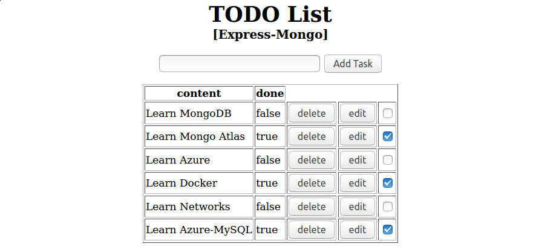
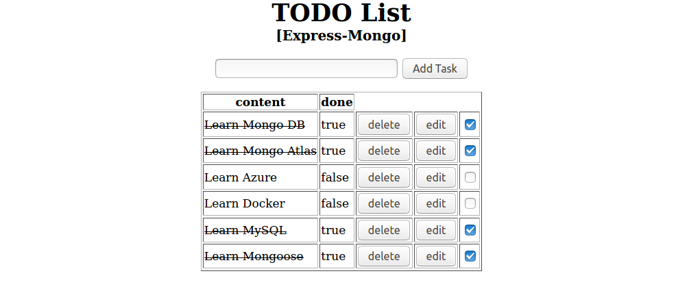

## Description 📖
A Todo List Web App

## ScreenShot 📸
<!--  -->

## Demos 🖥️
[Live Demo](https://todo-express-mongo.herokuapp.com/)  🚀

## API 
Method|Endpoint|Results
-|-|-
GET|/api/tasks/|[{...},{...}, ...,{...}]
GET|/api/task/:id| {...}
DELETE|/api/tasks/:id| {status: 'task deleted'}
POST|/api/tasks| {status: 'task added'}
PUUT|/api/tasks/:id| {status: 'tasks updated'}

## Tools 🧰

- Express
- EJS
- MongoDB
- Mongo-Atlas
